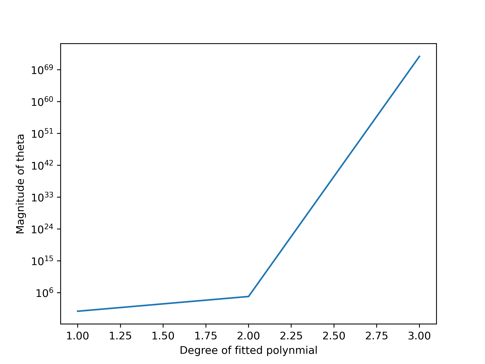

# ES654-2020 Assignment 3

*Your Name* - *Your Roll Number*

------

> Write the answers for the subjective questions here

The magnitude of theta increases exponentially as the degree of polynomial rises. 
It is because as the degree increases, the linear regressor tries to fit all the data points correctly. Hence the values of coefficients rises.

