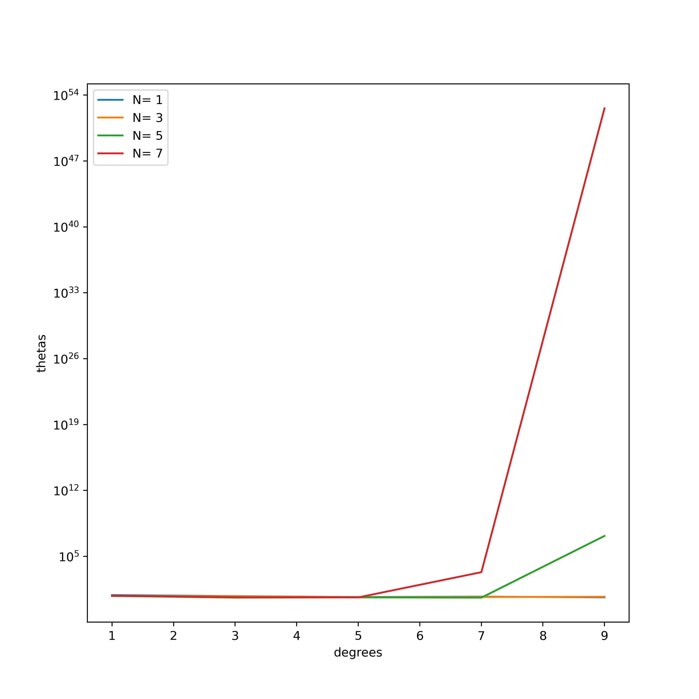

# ES654-2020 Assignment 3

*Your Name* - *Your Roll Number*

------

> Write the answers for the subjective questions here

The magnitude of theta increases exponentially as the degree of polynomial rises. 
It is because as the degree increases, the linear regressor tries to fit all the data points correctly. Hence the values of coefficients rises.

However, there is no significant dependence on varying N. As the number of datapoints increases, it overfits the data and hence the magnitude of theta increases, with some spikes in between. This is shown in the figure below:

### Theta v/s Degree plot

