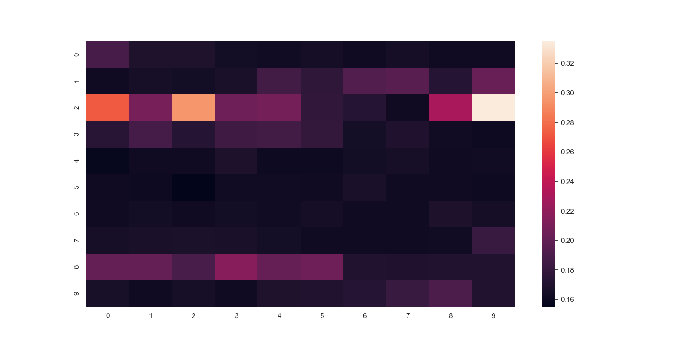

# ES654-2020 Assignment 3

*Your Name* - *Your Roll Number*

------

> Write the answers for the subjective questions here

## Using matplotlib

### Varying N

### Varying P

## Heatmaps

### For gradient descent 

### For Normal method
